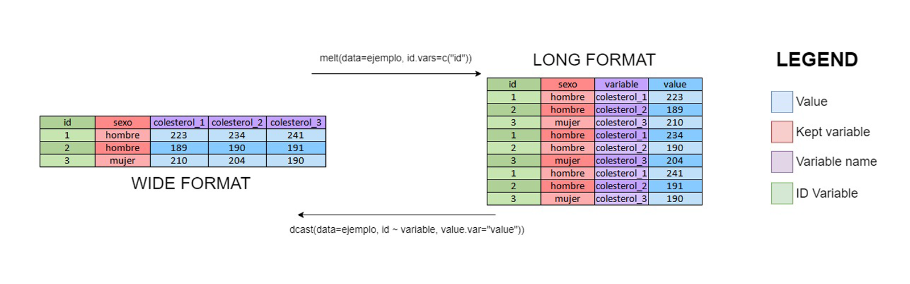

# Estructura de los datos

## Formato ancho y largo

Una vez que hemos recogido nuestros datos, debemos proceder con un análisis descriptivo para saber qué modelo debemos usar con el fin de contestar a las preguntas científicas planteadas en el estudio. La organización y visualización de los datos en estudios longitudinales no es tan sencilla como en cualquier otro tipo de diseño ya que los datos se pueden organizar de formas distintas. Básicamente, podemos:

- Datos a nivel de individuo, en el que cada individuo tiene un registro y múltiples variables contienen los datos de cada ocasión de medición (datos en formato ancho - *wide format* en inglés).

- Datos a nivel de tiempo, en el que cada persona tiene varios registros, uno para cada ocasión de medición (datos en formato largo - *long format* en inglés).

Las funciones que tenemos en R tanto para visualizar como modelizar datos longitudinales puede requerir el tener los datos en cualquiera de los dos formatos. El formato largo normalmente se necesita para agrupar variables como por ejemplo si queremos visualizar nuestra información mediante gráficos de barras apilados. En R existen muchas funciones para pasar de formato ancho a largo y viceversa. Recientemente se han creado las fuciones `dcast()` y `melt()` en la librería `reshape2` que facilitan enormemente estas tareas. La siguiente figura muestra un ejemplo de cómo utilizar estas funciones:

```{r , fig.cap="Datos en formato ancho y largo y cómo pasar de un formato a otro usando funciones de la librería `reshape2`", fig.height=14, echo=FALSE}

``` 


Veamos cómo realizarlo con R. Empecemos por cargar los datos que hemos visto en el ejemplo anterior

```{r}
datos <- read.delim("datos/ejemplo.txt")
datos
```

Vemos que están en formato ancho. Podemos pasarlos a formato largo utilizando la función `melt()` que tiene los siguientes argumentos:

- `data` es el objeto (data.frame o tibble) que vamos a convertir de ancho a largo,
- `id.vars` son las variables en la tabla que vamos a dejar sin cambiar de dimensión. En nuestro ejemplo sería la variable "sexo", aunque pueden ser más en tablas más complejas. Puede usarse un vector de nombres (tipo character) o de números enteros que correspondan al número de columna.
- `measure.vars` son las variables en las que se encuentran las mediciones. Puede ser un vector de nombres o de números enteros indicando los índices de las columnas. En nuestro caso son las columnas 3 a 5.
- `variable.name` es el nombre que va a adoptar la columna en la que queden nuestras variables, es decir, en nuestro caso sería el tiempo. Por defecto usa "variable".
- `value.name` es el nombre que va a adoptar la columna en la que queden los valores, que en nuestro caso sería el colestero. Por defecto usa "value".
- `variable.factor` es una valor lógico (TRUE o FALSE) para indicar si queremos que la columna de variable quede convertida a factor (opción por defecto), o quede simplemente como caracter.


Veamos cómo aplicamos esto a nuestro ejemplo
```{r}
library(reshape2)
datos_largo <- melt(datos, measure.vars=3:5,
                    variable.name = "tiempo",
                    value.name = "colesterol")
datos_largo
```

Notemos que nuestra variable `tiempo` no es numérica indicando el momento donde se toma la medida de colesterol. Debería de ser una variable numérica 1, 2, 3. Podemos solucionar esto eliminando "colesterol_" de la variable simplemente ejecutando:

```{r}
library(tidyverse)
datos_largo <- mutate(datos_largo, 
                      tiempo = str_remove(tiempo, "colesterol_") %>%
                      as.numeric())
datos_largo
```

Podemos ordenar nuestros datos por individuo y tiempo de la siguiente manera

```{r}
datos_largo <- arrange(datos_largo, id, tiempo)
datos_largo
```


Veamos ahora cómo pasar de formato largo a ancho. Para esta tarea usamos la función `dcast()`. Esta función tiene una notación un poco diferente, pues usa fórmulas para determinar qué variables poner en cada lugar. Tiene los siguientes argumentos:

- `data` es la tabla que vamos a convertir,
- `formula` es la forma en que vamos a distribuir las columnas. En general la fórmula es de forma x ~ y. Se puede usar una regla nemotécnica que consiste en: filas ~ columnas.
- `drop` deberían los valores faltantes ser eliminados o mantenidos?. Por defecto es TRUE y no se ponen.
- `value.var` es el nombre (o número) de la columna en la que están los valores. Generalmente `dcast()` adivina bien este valor, pero es bueno usarlo para asegurarnos de lo que estamos haciendo y evitar que salga un mensaje de advertencia.

En nuestro caso ejecutaríamos:

```{r}
datos_ancho <- dcast(datos_largo, id ~ tiempo,
                     value.var = "colesterol")
datos_ancho
```
Si queremos mantener el resto de covariables debemos ejecutar:

```{r}
datos_ancho <- dcast(datos_largo, id + sexo ~ tiempo, 
                     value.var = "colesterol")
datos_ancho
```

que es justo el conjunto de datos inicial del que partíamos excepto por el nombre de las variables (que ahora se llaman 1, 2, 3). Para poder poner el nombre original, basta con ejecutar:


```{r}
datos_ancho <- dcast(datos_largo, id + sexo ~ paste0("colesterol_", tiempo), 
                     value.var = "colesterol")
datos_ancho
```


Veamos ahora ejemplos más reales donde tenemos más de una variable repetida a lo largo del tiempo, datos faltantes u datos recogidos en distintos tiempos.


## Formato ancho

Como hemos comentado anteriormente, lo normal es recoger los datos en formato ancho (u horizontal) data su simplicidad. 

```{r, echo=FALSE}
library(knitr)
library(kableExtra)

set.seed(123456)

n <- 6; k <- 3
colest <- matrix(round(rnorm(n*k, 200,15)),n,k)
colnames(colest) <- paste("coltot",1:k,sep="_")
bmi <- matrix(round(rnorm(n*k, 30,2),1),n,k)
colnames(bmi) <- paste("bmi",1:k,sep="_")
sexo <- rbinom(n, 1, 0.5)
edad <- round(rnorm(n, 50,5),0)
ind <- 1:n

taulah <- data.frame(ind,sexo,edad,colest,bmi)
kable(taulah, digits=c(0,0,0,rep(1,k*2)), align="c")%>%kable_styling()%>%
  kableExtra::row_spec(which(ind%%2==0), background=grey(1))%>%
  kableExtra::row_spec(which(ind%%2==1), background=grey(0.95))
```

La **ventaja** de esta estrategia es que tenemos una fila para cada individuo, como estamos acostumbrados. 

Sin embargo, existen varios **inconvenientes**:

- Si tenemos un missing en alguna medida hay que eliminar a todo el individuo

- Debemos suponer que todas las medidas se han realizado en los mismos momentos para todos los individuos, y esto puede no ser cierto.

- Las diferentes medidas de una misma variable predictora la debemos analizar como si fueran distintas variables

## Formato largo

Estos mismos datos se dispondrían de la siguiente forma en formato largo (o vertical)

```{r, echo=FALSE}
ind <- rep(1:n, each=k)
colest <- as.vector(t(colest))
bmi <- as.vector(t(bmi))
edad <- rep(edad, each=k)
sexo <- rep(sexo, each=k)
momento <- rep(1:k, n)
taulav <- data.frame(ind, sexo, edad, coltot=colest, bmi, momento)
kable(taulav, digits=c(0,0,0,1,1), align="c")%>%kable_styling(bootstrap_options="basic")%>%
  kableExtra::row_spec(which(ind%%2==0), background=grey(1))%>%
  kableExtra::row_spec(which(ind%%2==1), background=grey(0.95))
```


## Valores faltantes


Cuando hay valores faltantes en una medida y los datos se disponen de forma horizontal se descartan los demás valores ya que se elimina toda la fila.

```{r, echo=FALSE}
taulahm <- taulah
taulahm[2,"coltot_2"]<-NA
taulahm[5,"coltot_3"]<-NA
kable(taulahm, digits=c(0,0,0,rep(1,k*2)), align="c")%>%kable_styling()%>%
  kableExtra::row_spec(which(taulah$ind%%2==0), background=grey(1))%>%
  kableExtra::row_spec(which(taulah$ind%%2==1), background=grey(0.95))%>%
  kableExtra::row_spec(which(apply(is.na(taulahm), 1, any)), color="red")
```

En cambio, en la disposición vertical sólo se pierden los valores de los tiempos en cuestión y no todas las medidas del individuo.

```{r, echo=FALSE}
taulavm <- taulav
taulavm[taulavm$ind==2 & taulavm$momento==2,"coltot"]<-NA
taulavm[taulavm$ind==5 & taulavm$momento==3,"coltot"]<-NA
kable(taulavm, digits=c(0,0,0,rep(1,k*2)), align="c")%>%kable_styling()%>%
  kableExtra::row_spec(which(taulav$ind%%2==0), background=grey(1))%>%
  kableExtra::row_spec(which(taulav$ind%%2==1), background=grey(0.95))%>%
  kableExtra::row_spec(which(apply(is.na(taulavm), 1, any)), color="red")
```

## Tiempos de medidas diferentes

Al disponer los datos de forma vertical se puede especificar en qué momento se ha recogido cada medida. Para ello simplemente se indica en la variable tiempo. Por ejemplo si se trata de los días que han pasado desde el momento inicial del experimento.


```{r, echo=FALSE}
taulav$dias <- as.vector(replicate(n,{sort(sample(1:10,3))}))
kable(taulav, digits=c(0,0,0,rep(1,k*2)), align="c")%>%kable_styling()%>%
  kableExtra::row_spec(which(taulav$ind%%2==0), background=grey(1))%>%
  kableExtra::row_spec(which(taulav$ind%%2==1), background=grey(0.95))
```

O incluso podemos tener mas medidas para unos individuos que para otros. Como sería el caso que tuviéramos algún missing en alguna medida. Como en este ejemplo, para el individuo 2 y el 5 tenemos sólo 2 medidas, mientras que para el resto tenemos 3.

```{r, echo=FALSE}
taulavm <- taulav
taulavm[taulavm$ind==2 & taulavm$momento==2,"coltot"]<-NA
taulavm[taulavm$ind==5 & taulavm$momento==3,"coltot"]<-NA
kable(na.omit(taulavm), digits=c(0,0,0,rep(1,k*2)), align="c",row.names=FALSE)%>%kable_styling()%>%
  kableExtra::row_spec(which(na.omit(taulavm)$ind%%2==0), background=grey(1))%>%
  kableExtra::row_spec(which(na.omit(taulavm)$ind%%2==1), background=grey(0.95))
```

## Transformación

### Vertical a horizontal y viceversa

En esta sección aprovecharemos para ver otras instrucciones útiles en **`R`** para pasar de la disposición vertical de los datos a la horizontal y viceversa (aunque yo recomiendo usar `melt()` y `dcast()`. Para ello usaremos los datos del ejemplo anterior que están guardados en formato .csv de la siguiente manera: 


```{r}
tablahorizontal <- read.csv2("datos/tablahorizontal.csv")
tablahorizontal
```

Como tenemos la base de datos en horizontal (una fila por individuo) y la queremos pasar a vertical (un registro por fila y varias filas por individuo) podemos usar:


```{r}
tablong <- reshape(data=tablahorizontal, 
                   direction="long", 
                   varying=list(c("coltot_1","coltot_2","coltot_3"),
                                c("bmi_1","bmi_2","bmi_3")), 
                   times=1:3, 
                   timevar="momento", 
                   idvar="ind",
                   v.names=c("coltot","bmi"))
tablong
```

Ordeno la tabla por id y dentro de cada id por tiempo

```{r}
tablong <- arrange(tablong, ind, momento)
tablong
```

Y si queremos pasar del formato largo al horizontal

```{r}
tablavertical <- read.csv2("datos/tablavertical.csv")
tablavertical
```

```{r}
tabwide <- reshape(data=tablavertical, 
                   direction="wide", 
                   v.names=c("coltot","bmi"), 
                   times=1:3, 
                   timevar="momento", 
                   idvar="ind")
tabwide
```


¿Y si tenemos algun individuo con menos medidas? Por ejemplo, tenemos la tabla en formato vertical y para el individuo id=1 tenemos dos medidas en lugar de 3 (quitamos la tercera medida)

```{r}
tablaverticalmiss <- tablavertical[-3,]
tablaverticalmiss
```

```{r}
tabwidemiss <- reshape(data=tablaverticalmiss, 
                       direction="wide", 
                       v.names=c("coltot","bmi"), 
                       times=1:3, 
                       timevar="momento", 
                       idvar="ind")
tabwidemiss
```
### Colapsar

Si tenemos los datos en vertical y queremos colapsar o resumir los distintos datos de cada individuo en un único valor, como por ejemplo la media.

```{r}
library(dplyr) 
library(magrittr)

group_by(tablavertical, ind) %>%
  summarise_at(vars(coltot, bmi), list(media = mean))
```


